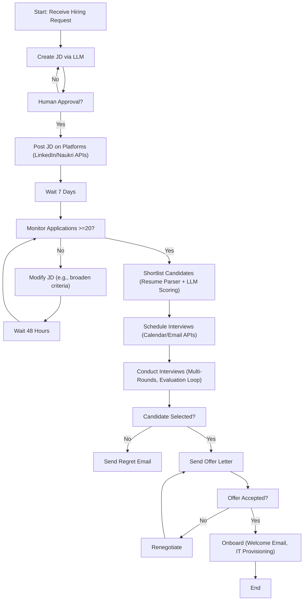
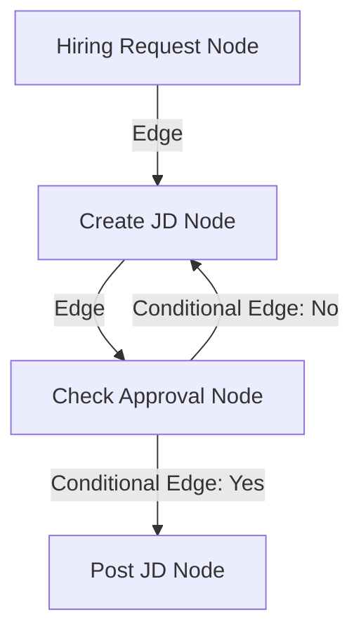

# Introduction to LangGraph 

## Quick Recap of LangChain
- **Definition**: Open-source library to simplify building LLM-based applications.
- **Purpose**: Integrates LLMs into software; handles complexities of LLM apps.
- **Modular Building Blocks**:
  - **Models**: Unified interface for any LLM provider (e.g., OpenAI, Anthropic, Hugging Face, Ollama).
  - **Prompts**: Engineer and manage prompts for LLMs.
  - **Retrievers**: Fetch relevant documents from vector stores/knowledge bases (enables RAG apps).
  - **Chains**: Core feature; connect components into linear workflows (output of one becomes input of next).
- **Use Cases**:
  - Simple conversational flows (e.g., chatbots, text summarizers).
  - Multi-step workflows (e.g., generate report from topic, then summarize it).
  - RAG-based apps (e.g., chat over company docs).
  - Basic agents (e.g., LLM with tools like weather API for dynamic decisions).

## Why LangGraph Exists: Practical Scenario (Automated Hiring Workflow)
- Reuses automated hiring example from Video 2 (HR recruiter hires backend engineer autonomously).
- **Key Insight**: Differentiate workflows (pre-defined code paths) vs. agents (LLMs dynamically direct processes).
  - Workflows: Static, developer-defined (e.g., flowchart below).
  - Agents: Dynamic, LLM-planned (varies per run).
- Detailed flowchart created for the workflow (non-agentic version):
  - Start: Receive hiring request (e.g., "Hire remote backend engineer, 2-4 years exp").
  - Create JD (Job Description) using LLM.
  - Human approval loop: If not approved, recreate JD; if approved, post on platforms (LinkedIn, Naukri via APIs).
  - Wait 7 days; monitor applications (threshold: 20+).
  - If <20: Modify JD (e.g., broaden to full-stack), wait 48 hours, re-monitor (loop until threshold met).
  - Shortlist candidates (resume parser + LLM scoring).
  - Schedule interviews (calendar API, email API).
  - Conduct interviews (multiple rounds, evaluation loops).
  - For each candidate: If selected, send offer; if rejected, send regret email.
  - Offer loop: If rejected, renegotiate; if accepted, onboard (welcome email, IT provisioning via HR tools).
- Flowchart (Corrected Mermaid Diagram for Visualization - Labels quoted to fix parsing errors):

- This flowchart is static (workflow), not dynamic (agentic).

## Challenges with LangChain for Complex Workflows
- Attempt to implement the above workflow in LangChain reveals limitations (conceptual, not full code).
- **Challenge 1: Control Flow Complexity (Non-Linear Flows)**:
  - LangChain excels at linear chains but struggles with conditionals, loops, jumps.
  - Requires custom Python "glue code" (e.g., while loops, if-else), reducing maintainability.
  - LangGraph Solution: Represents workflows as graphs (nodes = tasks, edges = control flow); supports loops/conditionals natively (no glue code).
    - Example Mermaid for LangGraph subset (Corrected):

- **Challenge 2: State Handling**:
  - State: Key-value pairs tracking progress (e.g., JD text, approval status, applications count).
  - LangChain is stateless (conversational memory only); requires manual dictionaries/glue code.
  - LangGraph Solution: Stateful execution; define state object (dict/Pydantic) accessible/mutable by all nodes; auto-updates as graph progresses.
- **Challenge 3: Event-Driven Execution**:
  - Sequential vs. Event-Driven: Pause for external triggers (e.g., wait 7 days, human input).
  - LangChain assumes short, sequential runs; requires splitting chains + glue code.
  - LangGraph Solution: Built-in pauses/resumes via checkpoints; supports async/long-running flows.
- **Challenge 4: Fault Tolerance**:
  - Recover from errors (small: API failures; big: server crashes).
  - LangChain lacks recovery; restarts from beginning.
  - LangGraph Solution: Retry logic for small faults; checkpoints persist state for resumption from failure point.
- **Challenge 5: Human-in-the-Loop**:
  - Pause for human approval (e.g., JD review).
  - LangChain supports short inputs but not long pauses (requires chain splitting + glue).
  - LangGraph Solution: First-class support; indefinite pauses until human input, resumes via checkpoints.
- **Challenge 6: Nested Workflows**:
  - Embed sub-workflows (e.g., "Conduct Interview" as separate graph).
  - LangChain doesn't support natively.
  - LangGraph Solution: Subgraphs (graph as node); enables multi-agent systems and reusability.
- **Challenge 7: Observability**:
  - Monitor/debug runtime (e.g., via LangSmith).
  - LangChain: Partial (tracks chains but not glue code).
  - LangGraph: Full integration with LangSmith; chronological timeline of nodes, state changes, decisions.
- **Challenge 8: Reusability & Maintainability** (implied from above): Excessive glue code in LangChain; LangGraph minimizes it via graph abstraction.

## LangChain vs. LangGraph
- **When to Use LangChain**: Simple, linear workflows (e.g., prompt chains, basic RAG, summarizers).
- **When to Use LangGraph**: Complex, non-linear workflows (conditionals, loops, event-driven, human-in-loop, multi-agent).
- **Relationship**: LangGraph builds on LangChain (uses its components like models, prompts); not a replacement.
  - LangChain: Provides building blocks (models, prompts, retrievers, chains).
  - LangGraph: Orchestrates complex flows (graphs for stateful, event-driven execution).

## Conclusion
- LangGraph: Orchestration framework for stateful, multi-step, event-driven workflows using LLMs; ideal for single/multi-agent apps.
- Think of it as a "flowchart engine" for LLMs: Nodes (steps), edges (logic), handles state/branching/loops/pauses/recovery.
- Use both: LangChain for components; LangGraph for orchestration.
