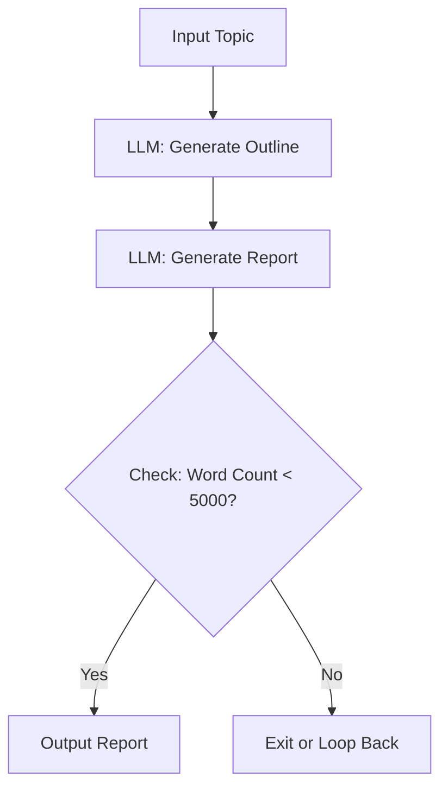
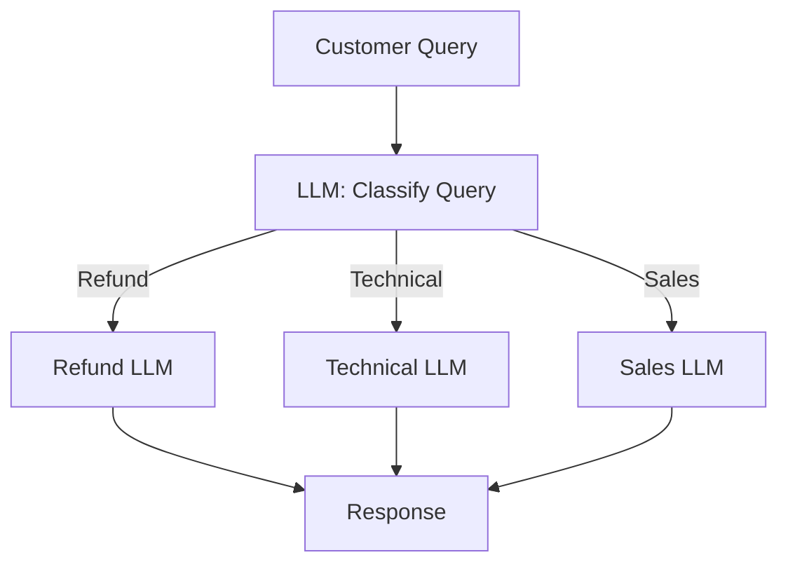
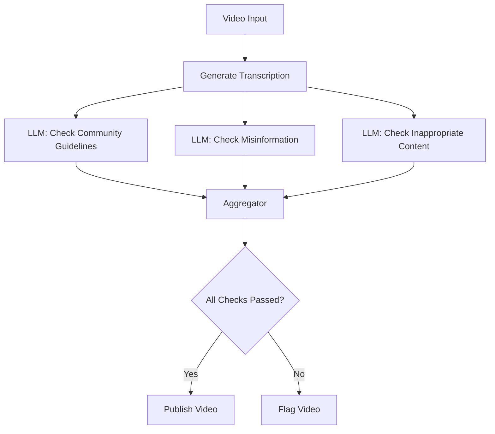
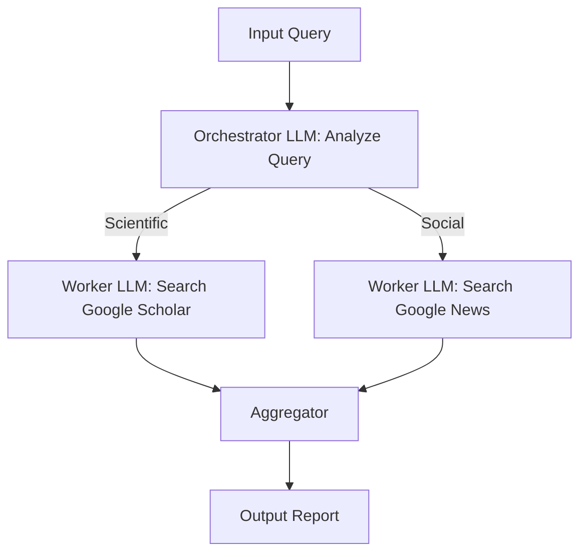
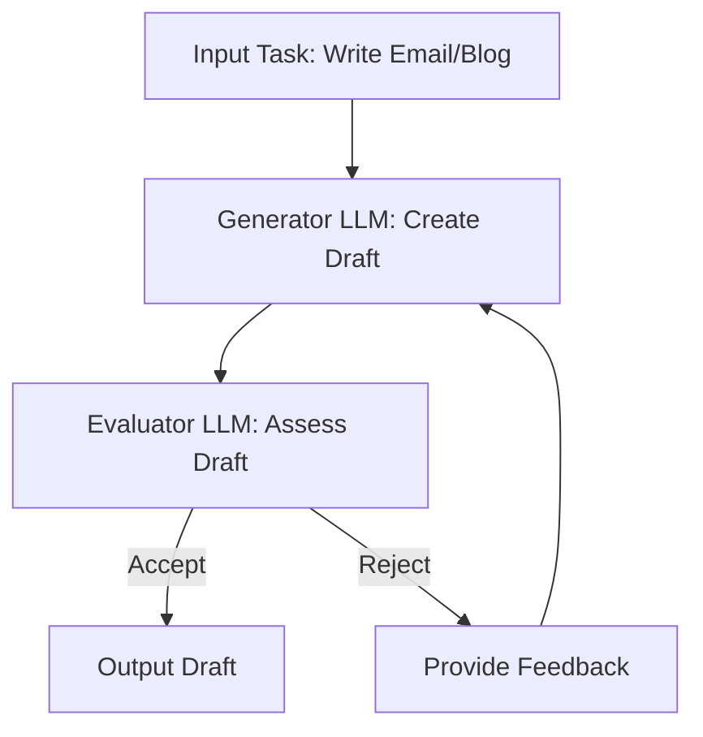
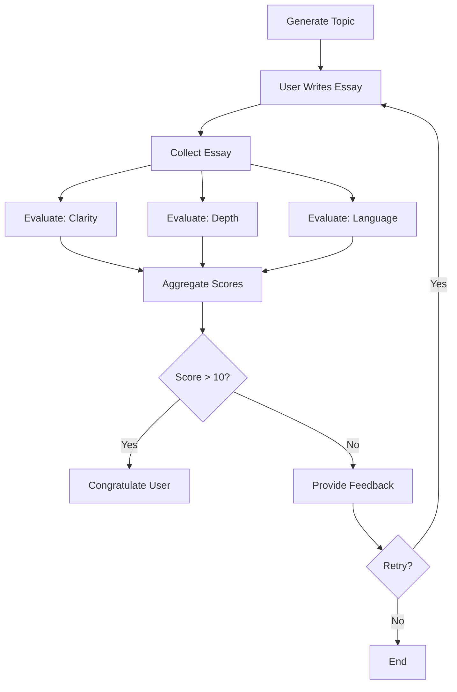
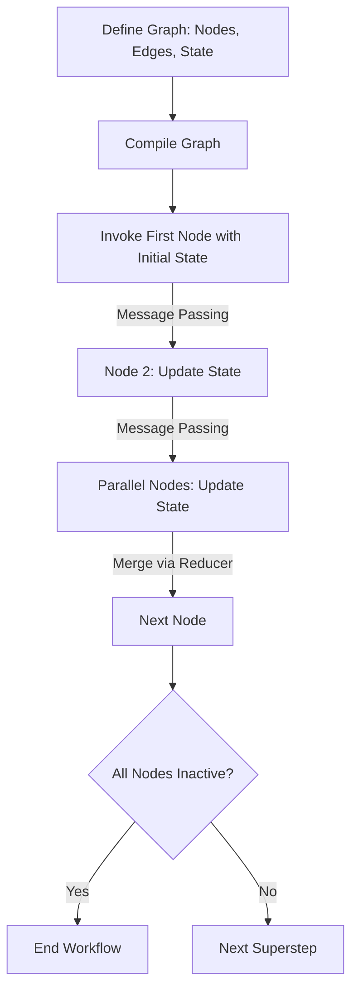

# LangGraph Core Concepts

This document provides comprehensive notes discussing the core concepts of **LangGraph**, an orchestration framework for building intelligent, stateful, and multi-step Large Language Model (LLM) workflows. The notes cover the introduction to LangGraph, its core features, common LLM workflows, and key concepts like graphs, nodes, edges, state, reducers, and the execution model.

---

## Introduction to LangGraph

### What is LangGraph?

LangGraph is an **orchestration framework** designed to represent and execute complex LLM workflows as a **graph**. In this graph:
- **Nodes** represent individual tasks within the workflow.
- **Edges** define the flow of execution, indicating which task should follow another.

**Key Characteristics**:
- LangGraph converts an LLM workflow into a graph structure where each node corresponds to a specific task, such as:
  - Calling an LLM.
  - Invoking a tool.
  - Making a decision.
- Nodes are connected by edges, which dictate the sequence or conditions for task execution.
- LangGraph allows workflows to be represented as flowcharts and executed systematically by providing inputs to the first node, triggering the entire graph.

**Core Features**:
- **Parallel Task Execution**: Multiple tasks can run simultaneously.
- **Loops**: Workflows can include iterative processes.
- **Branching**: Conditional logic can direct the flow to different nodes.
- **Memory**: Records and retains conversation or task history.
- **Resumability**: Allows resuming a workflow from a specific point if it breaks down.

**Summary**:
LangGraph is ideal for building **agentic** and **production-grade AI applications** by providing a structured way to represent and execute complex LLM workflows.

---

## Core Concept 1: LLM Workflows

### What is a Workflow?

A **workflow** is a **series of tasks** executed in a specific order to achieve a goal. For example:
- In an **automated hiring workflow** , tasks include:
  1. Creating a job description (JD).
  2. Posting the JD.
  3. Shortlisting candidates.
  4. Conducting interviews.
  5. Onboarding.

Executing these tasks in the correct order achieves the goal of hiring a candidate.

### What is an LLM Workflow?

An **LLM workflow** is a workflow where multiple tasks depend on Large Language Models (LLMs). For instance, in the automated hiring example:
- Writing the JD may require an LLM.
- Shortlisting candidates may involve an LLM for resume screening.
- Conducting interviews might use an LLM for question generation or evaluation.

**Definition**: An LLM workflow is a step-by-step process that uses LLMs to perform tasks like prompting, reasoning, tool calling, memory access, and decision-making. These workflows can be:
- **Linear**: Sequential task execution.
- **Parallel**: Multiple tasks executed simultaneously.
- **Branched**: Conditional task execution.
- **Looped**: Iterative task execution.

**Key Insight**: Every application has a unique workflow, but certain **common LLM workflows** are frequently encountered.

---

## Common LLM Workflows

Below are five common LLM workflows that appear in many applications and will be covered practically in the playlist.

### 1. Prompt Chaining

**Definition**: A workflow where an LLM is called multiple times in sequence to complete a complex task by breaking it into smaller subtasks.

**Example**:
- **Task**: Generate a detailed report on a given topic.
- **Steps**:
  1. The user provides a topic.
  2. The first LLM call generates an outline based on the topic.
  3. The second LLM call uses the outline to create a detailed report.
- **Validation**: A check can be added (e.g., ensure the report is under 5000 words). If the check fails, the workflow can exit or loop back.

**Diagram**:


**Use Case**: Breaking down complex tasks into manageable subtasks with intermediate checks.

---

### 2. Routing

**Definition**: A workflow where an LLM analyzes an input task and routes it to the most appropriate LLM or tool for execution.

**Example**:
- **Task**: Build a customer support chatbot.
- **Steps**:
  1. A customer query is received (e.g., technical issue, refund request, or sales inquiry).
  2. An LLM analyzes the query to classify it.
  3. The query is routed to the appropriate LLM:
     - Refund-related → Refund LLM.
     - Technical issue → Technical LLM.
     - Sales inquiry → Sales LLM.

**Diagram**:


**Use Case**: Directing tasks to specialized components based on their nature.

---

### 3. Parallelization

**Definition**: A workflow where a task is divided into multiple subtasks that are executed in parallel, with results aggregated to produce a final outcome.

**Example**:
- **Task**: Content moderation for YouTube videos.
- **Steps**:
  1. A video is submitted for moderation.
  2. The video is checked from multiple perspectives in parallel:
     - Compliance with community guidelines.
     - Presence of misinformation.
     - Presence of inappropriate content.
  3. Results are aggregated to decide whether the video can be published.

**Diagram**:


**Use Case**: Simultaneous processing of independent subtasks to improve efficiency.

---

### 4. Orchestrator-Worker Workflow

**Definition**: Similar to parallelization, but the subtasks are dynamically determined based on the input, rather than predefined.

**Example**:
- **Task**: Build a research assistant to generate a detailed report on a query.
- **Steps**:
  1. The orchestrator LLM analyzes the query to determine required subtasks.
  2. Subtasks are assigned to worker LLMs dynamically:
     - For a scientific query, search Google Scholar for research papers.
     - For a social phenomenon, search Google News.
  3. Results from worker LLMs are aggregated into a final report.

**Diagram**:


**Key Difference from Parallelization**: Subtask nature is determined dynamically based on the input query, not predefined.

**Use Case**: Flexible workflows where task requirements vary based on input.

---

### 5. Evaluator-Optimizer Workflow

**Definition**: A workflow where an LLM generates a solution, which is evaluated by another LLM. If the solution is rejected, feedback is provided, and the process iterates until an acceptable solution is produced.

**Example**:
- **Task**: Draft an email or write a blog post.
- **Steps**:
  1. A generator LLM creates an initial draft (solution).
  2. An evaluator LLM assesses the draft against specific criteria (e.g., tone, clarity, length).
  3. If accepted, the draft is output. If rejected, feedback is provided, and the generator LLM produces a revised draft.
  4. The process loops until the evaluator accepts the solution.

**Diagram**:


**Use Case**: Iterative improvement of creative outputs like emails, blogs, or poems.

---

## Core Concept 2: Graphs, Nodes, and Edges

### Overview

LangGraph represents LLM workflows as graphs, where:
- **Nodes**: Individual tasks (implemented as Python functions).
- **Edges**: Connections defining the execution flow between nodes.

**Key Insight**: The graph structure allows flexible representation of sequential, parallel, branched, or looped workflows.

### Example: UPSC Essay Evaluation Workflow

**Scenario**:
A website helps UPSC aspirants practice essay writing. The workflow:
1. Generates an essay topic.
2. Collects the user’s essay.
3. Evaluates the essay from multiple perspectives (clarity, depth, language).
4. Aggregates scores to produce a final score (out of 15, threshold = 10).
5. If the score is above the threshold, congratulates the user. If below, provides feedback and allows a rewrite.
6. Iterates if the user chooses to revise.

**Diagram**:


**Observations**:
- **Nodes**: Each task (e.g., generate topic, evaluate clarity) is a node, implemented as a Python function.
- **Edges**: Define the flow (e.g., sequential from topic generation to essay collection, parallel for evaluations, conditional for score checking).
- **Benefits**:
  - Nodes represent tasks clearly.
  - Edges allow flexible flow (sequential, parallel, branching, looping).
  - The graph structure simplifies complex workflow representation.

---

## Core Concept 3: State

### What is State?

The **state** is a shared, mutable memory that flows through the workflow, holding all data required for execution. It evolves as the workflow progresses.

**Key Characteristics**:
- **Shared**: Accessible to all nodes.
- **Mutable**: Nodes can update the state.
- **Implementation**: Typically a **TypedDict** (a Python class) or a Pydantic object, structured as key-value pairs.

**Example (UPSC Workflow)**:
- **Data Points in State**:
  - Essay topic.
  - Essay text.
  - Clarity score.
  - Depth score.
  - Language score.
  - Overall score.
- **Usage**:
  - The essay text is stored in the state and used for evaluation.
  - Scores are updated in the state during evaluation.
  - The final score determines the workflow’s next step.

**How State Works**:
1. Each node receives the entire state as input.
2. The node performs its task and updates the state (e.g., adds a score or modifies the essay text).
3. The updated state is passed to the next node via edges.
4. The state evolves throughout the workflow, retaining all necessary data.

**Diagram**:
```mermaid
graph TD
    A[Node 1: Generate Topic] -->|State: {topic}| B[Node 2: Collect Essay]
    B -->|State: {topic, essay}| C[Node 3: Evaluate Clarity]
    C -->|State: {topic, essay, clarity_score}| D[Node 4: Aggregate Scores]
    D -->|State: {topic, essay, clarity_score, final_score}| E[Node 5: Check Score]
```

**Importance**: The state ensures all nodes have access to the data they need, and its mutability allows dynamic updates as the workflow progresses.

---

## Core Concept 4: Reducers

### What are Reducers?

**Reducers** define how updates to the state are applied. Each key in the state can have its own reducer, determining whether new data:
- **Replaces** the existing value.
- **Adds** to the existing value (e.g., appends to a list).
- **Merges** with the existing value.

**Example 1: Simple Workflow (Sum and Multiply)**:
- **Task**: Take two numbers, compute their sum, multiply by 2, and output the result.
- **State**: `{first_number, second_number, result}`
- **Execution**:
  1. Node 1: Updates state with `first_number = 5, second_number = 6`.
  2. Node 2: Computes sum (`5 + 6 = 11`) and updates `result = 11`.
  3. Node 3: Multiplies `result` by 2 (`11 * 2 = 22`) and updates `result = 22`.

**Issue**: The `result` key is replaced (11 → 22), which is fine here but problematic in some cases.

**Example 2: Chatbot Workflow**:
- **Task**: A human and LLM interact in a loop.
- **State**: `{messages}`
- **Execution**:
  1. Human inputs: “Hi, my name is Nitish.”
     - State: `messages = "Hi, my name is Nitish"`
  2. LLM responds: “Hi, how can I help you?”
     - State: `messages = "Hi, how can I help you?"` (replaces previous message)
  3. Human asks: “Can you tell me my name?”
     - State: `messages = "Can you tell me my name?"`
- **Issue**: The LLM cannot answer because the original message (“Hi, my name is Nitish”) was erased.

**Solution with Reducer**:
- Use an **add reducer** to append messages to a list instead of replacing them.
- Updated State: `messages = ["Hi, my name is Nitish", "Hi, how can I help you?", "Can you tell me my name?"]`
- Now, the LLM can access the entire conversation history.

**Example 3: UPSC Workflow**:
- **State**: `{essay_text}`
- **Issue**: If the user rewrites the essay, the previous essay is replaced, losing history.
- **Solution**: Use an **add reducer** to store essays as a list: `[essay_1, essay_2, essay_3]`.
- **Benefit**: The user can review past essays to track improvement.

**Key Insight**: Reducers are critical for preserving or modifying state appropriately, especially in parallel workflows or scenarios requiring history (e.g., chatbots, iterative tasks).

---

## Core Concept 5: LangGraph Execution Model

### Overview

LangGraph’s execution model is inspired by **Google Pregel**, a system for large-scale graph processing. It automates the execution of workflows by passing state through nodes via edges.

### Execution Process

1. **Graph Definition**:
   - Define nodes (Python functions), edges (execution flow), and state (TypedDict with key-value pairs).

2. **Graph Compilation**:
   - A `compile` function checks the graph’s structure for consistency (e.g., no orphaned nodes).
   - Ensures the graph is logically correct before execution.

3. **Execution Phase**:
   - **Invocation**: The first node is called with the initial state, activating it.
   - **Node Execution**: The node’s Python function runs, updates the state, and passes it to the next node(s) via edges.
   - **Message Passing**: The updated state is passed through edges to subsequent nodes.
   - **Supersteps**:
     - Each round of execution is called a **superstep**.
     - A superstep may involve one or multiple parallel node executions (e.g., in the UPSC workflow, clarity, depth, and language evaluations run in parallel).
     - Supersteps continue until no nodes are active, and no messages are being passed.

**Diagram**:


**Key Terms**:
- **Message Passing**: Transferring the state between nodes via edges.
- **Superstep**: A round of execution that may include one or multiple parallel steps.
- **Termination**: The workflow stops when no nodes are active, and no messages are being passed.

**Why “Superstep”?**
- In parallel workflows (e.g., UPSC evaluation), multiple nodes execute simultaneously within a single round. Calling this a “step” is inaccurate, so LangGraph uses “superstep” to account for parallel executions.

---

## Conclusion

This notes provides a **conceptual overview** of LangGraph’s core concepts, preparing users for practical implementation in future learnings. The key takeaways are:
- **LangGraph**: An orchestration framework for representing and executing LLM workflows as graphs.
- **LLM Workflows**: Series of tasks relying on LLMs, including prompt chaining, routing, parallelization, orchestrator-worker, and evaluator-optimizer workflows.
- **Graphs, Nodes, Edges**: Nodes are tasks (Python functions), and edges define execution flow.
- **State**: Shared, mutable memory holding data required for execution, evolving over time.
- **Reducers**: Define how state updates are applied (replace, add, merge).
- **Execution Model**: Inspired by Google Pregel, using graph definition, compilation, and supersteps with message passing.

